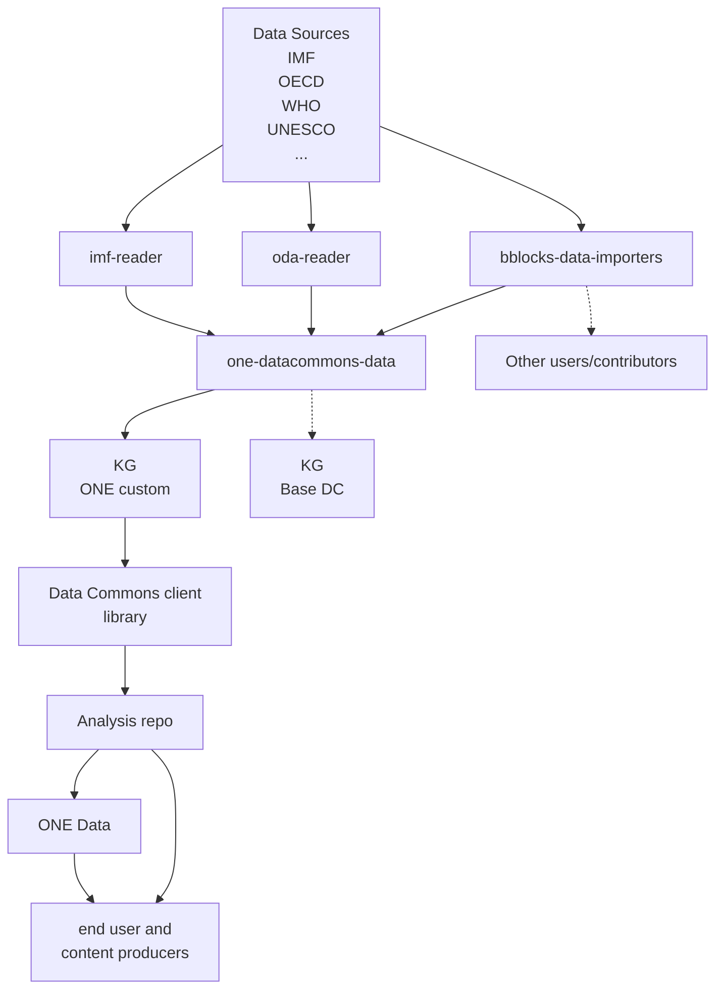

# Extract Transform Load (ETL)

This section provides an overview of the Extract, Transform, 
Load (ETL) processes used to build and maintain the Data Commons 
knowledge graph.

```mermaid
graph TD
    A[Data Sources<br/>IMF<br/>OECD<br/>WHO<br/>UNESCO<br/>...] --> B[bblocks-data-importers]
    A --> C[imf-reader]
    A --> D[oda-reader]

    C --> G[one-datacommons-data]
    D --> G
    B --> G

    G --> H[KG<br/>ONE custom]
    G -.-> I[KG<br/>Base DC]

    H --> J[Data Commons client<br/>library]
    J --> K[Analysis repo]
    K --> L[ONE Data]
    L --> M[end user and<br/>content producers]
    K --> M

    B -.-> N[Other users/contributors]

```
